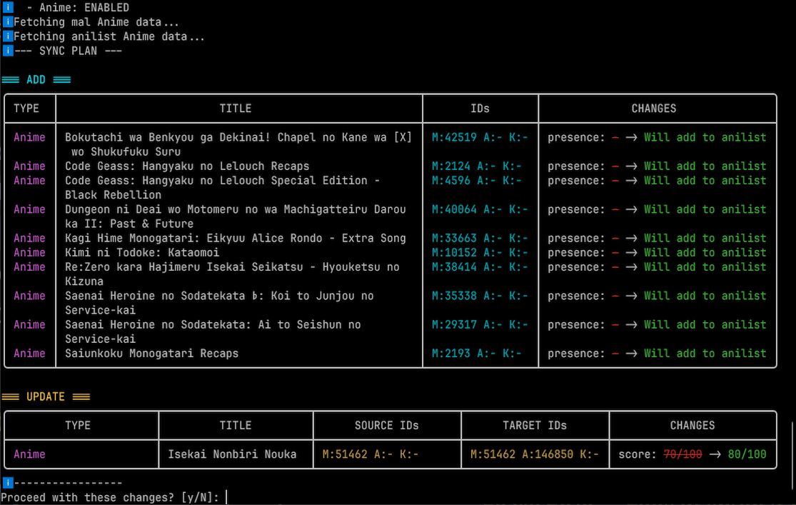

<p align="center">
  
</p>

# 🎌 Ani-Sync

**Seamlessly synchronize your anime and manga tracking lists across multiple platforms.**

[](https://github.com/Gilfaro/ani-sync/issues)
[](https://www.rust-lang.org)
[](https://opensource.org/licenses/MIT)
<br>
[](https://github.com/Gilfaro/ani-sync/releases)
[](https://github.com/Gilfaro/ani-sync/releases)
[](https://github.com/Gilfaro/ani-sync/releases)

Ani-Sync is a high-performance, non-destructive CLI tool designed for power users who want to keep their MyAnimeList, AniList, Kitsu, and MangaBaka accounts in perfect harmony.

---

## ✨ Key Features

- **🚀 Uni-directional Sync:** Keep your Anime and Manga lists synchronized between all supported services.
- **🛡️ Non-Destructive:** Ani-Sync never deletes entries. It only adds new ones or updates existing data, ensuring your history is always safe.
- **📊 Rich Sync Plans:** Preview every change in a colorized, high-fidelity ASCII table before applying it.
- **🧬 ID-Based Precision:** Uses MAL, AniList, and Kitsu IDs to ensure 100% accurate mapping across services.
- **🔐 Secure by Design:** Sensitive API tokens are stored safely in your operating system's native credential manager (Keychain, Secret Service, etc.).
- **⚡ Built for Speed:** Written in Rust with an asynchronous engine for lightning-fast API operations.

---

## 📸 Screenshots


*Example of a detailed sync plan showing proposed additions and updates.*

---

## 📥 Installation

### Pre-built Binaries (Recommended)

Ready-to-use executables for **Windows**, **macOS**, and **Linux** are automatically built via CI/CD. 
You can grab the latest version from the [Releases](https://github.com/Gilfar/ani-sync/releases) page.

Simply download the binary for your operating system, make it executable (on macOS/Linux), and add it to your system's PATH!

### From Source

Alternatively, Ani-Sync can be installed from source using Cargo:

```bash
# Clone the repository
git clone https://github.com/yourusername/ani-sync.git
cd ani-sync

# Build and install
cargo install --path .
```

---

## 🚀 Quick Start

### 1. Authenticate
Authenticate with the services you use:
```bash
ani_sync auth mal
ani_sync auth anilist
ani_sync auth kitsu
ani_sync auth mangabaka
```

### 2. Check Status
Verify which services are successfully authenticated:
```bash
ani_sync status
```

### 3. Synchronize
Perform a dry-run sync from MyAnimeList to AniList:
```bash
ani_sync sync --source mal --target anilist
```
Use the `--yes` or `-y` flag to skip the confirmation prompt.

---

## 🆚 Why Ani-Sync?

How does it compare to other tools like **MAL-Sync**?

| Feature | MAL-Sync ListSync | Ani-Sync |
| :--- | :---: | :---: |
| **Interface** | Browser Extension | CLI / Terminal |
| **Primary Use** | Bulk Synchronisation | Bulk Synchronisation |
| **Deletions** | Never (Non-destructive) | Never (Non-destructive) |
| **Sync ID matching** | Basic (only MAL) | **Comprehensive (MAL, Anilist, Kitsu)** |
| **Privacy** | Browser-based | Local-only Credential Storage |

---

## 🛠️ Supported Services

- [MyAnimeList (MAL)](https://myanimelist.net)
- [AniList](https://anilist.co)
- [Kitsu](https://kitsu.io)
- [MangaBaka](https://mangabaka.org)

---

## 🤝 Contributing

Contributions are welcome! Please feel free to submit a Pull Request.

## 📄 License

This project is licensed under the MIT License - see the [LICENSE](LICENSE) file for details.
